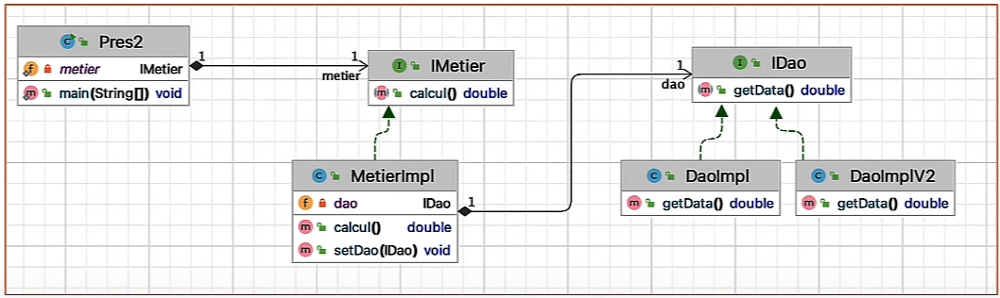
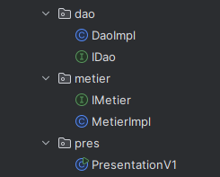

## Activité Pratique N°1 - Injection des dépendances

Ce TP permet d'appliquer les bonnes pratiques de développement, comme avoir une application fermée à la modification et ouverte à l'extension, en utilisant les interfaces, l'injection de dépendances et en séparant le code en un ensemble de packages.

On va essayer d'implimenter l'exemple suivant:


1. Créer des couches dao, metier et presentation

    
2. Créer l'interface IDao avec une méthode getData
    ```java
    public interface IDao {
        double getData();
    }
    ```
3. Créer une implémentation de cette interface
   ```java
    public class DaoImpl implements IDao {
    @Override
    public double getData() {
      System.out.println("Version base de données");
      double temp = 23;
      return temp;
     }
    }
    ```
4. Créer l'interface IMetier avec une méthode calcul
    ```java
    public interface IMetier {
        double calcul();
    
        public void setDao(IDao dao);
    }
    ```
5. Créer une implémentation de cette interface en utilisant le couplage faible
    ```java
    public class MetierImpl implements IMetier {
    
        //Couplage faible
        private IDao dao = null;
    
        @Override
        public double calcul() {
            double t = dao.getData();
            double res = t * 23;
            return res;
        }
    
        // Pour Injecter dans la variable dao un objet
        // d'une classe qui imlémente dl'interface IDao
        @Override
        public void setDao(IDao dao) {
            this.dao = dao;
        }
    }
    
    ```
6. Faire l'injection des dépendances :
   - Par instanciation statique
     - En utilisant le Setter
    ```java
    public class PresentationV1 {
        public static void main(String[] args) {
            // Injection des dépendances par instanciation statique (new)
            DaoImpl dao = new DaoImpl();
            MetierImpl metier = new MetierImpl();
            metier.setDao(dao); // Injection via le setter
            System.out.println("Resulat = " + metier.calcul());
        }
    }
    ```
    - En utilisant le constructeur 
    ```java
    public class PresentationV1 {
        public static void main(String[] args) {
            // Injection des dépendances par instanciation statique (new)
            DaoImpl dao = new DaoImpl();
            MetierImpl metier = new MetierImpl(dao); // Injection via constructeur
            System.out.println("Resulat = " + metier.calcul());
        }
    }
     // on ajoute les deux constructeur 
    public class MetierImpl implements IMetier {
    
        public MetierImpl() { // pour le setter
        }
    
        public MetierImpl(IDao dao) { // pour l'injection via constructreur
            this.dao = dao;
        }
    
    }
    ```
   - b. Par instanciation dynamique
   - c. En utilisant le Framework Spring
     - Version XML
     - Version annotations